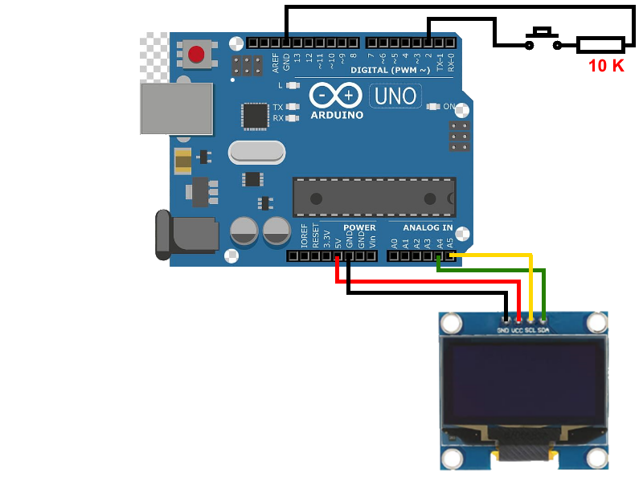

# arduino-pomodoro-timer

## Parts

- Arduino Uno
- 128x64 I2C OLED Display (SSD1306 driver chip)
- 10k resistor
- Push down button

## Schematic

## Sketch

[pomodoro_timer.ino](./pomodoro_timer/pomodoro_timer.ino)
